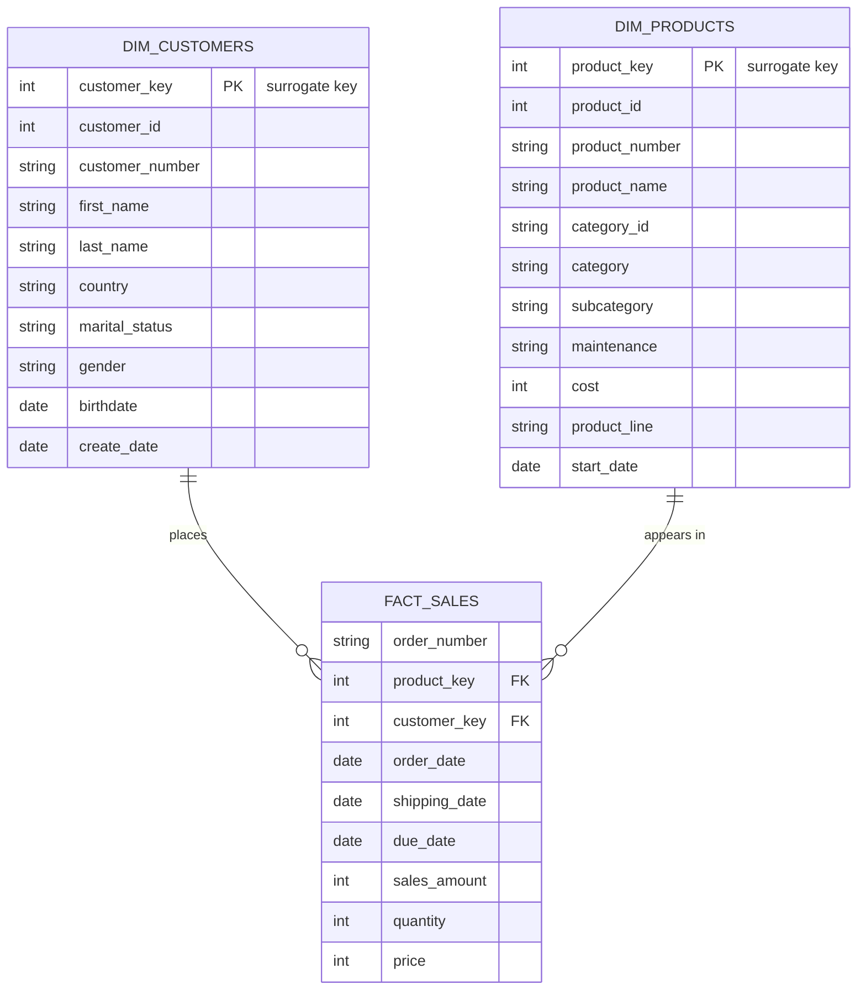
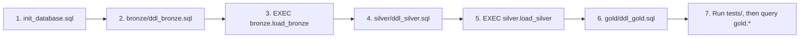

# SQL Data Warehouse

A SQL Server data warehouse that integrates CRM and ERP sales data into a single, analytics-ready star schema using a Bronze / Silver / Gold (medallion) architecture. Every layer — ingestion, cleansing, modeling, and testing — is implemented in T-SQL.


## Table of Contents

- [Overview](#overview)
- [Highlights](#highlights)
- [Architecture](#architecture)
- [Data Flow](#data-flow)
- [Data Model](#data-model)
- [Tech Stack](#tech-stack)
- [Repository Structure](#repository-structure)
- [Data Sources](#data-sources)
- [ETL Pipeline](#etl-pipeline)
- [Data Quality](#data-quality)
- [Naming Conventions](#naming-conventions)
- [Getting Started](#getting-started)
- [Example Queries](#example-queries)
- [Design Notes](#design-notes)


## Overview

Two source systems feed this warehouse: a **CRM** (customers, products, sales transactions) and an **ERP** (customer demographics, location, product categories). Neither system is reliable or complete on its own — keys are formatted differently, some fields conflict between systems, and the data needs cleansing before it can be trusted.

This repository builds a SQL Server warehouse that resolves that in three stages:

1. **Bronze** — raw CSV exports loaded as-is, with no transformation, for traceability.
2. **Silver** — data cleaned, standardized, and validated against explicit business rules.
3. **Gold** — Bronze/Silver tables integrated into a conformed star schema, exposed as views.

There is no external ETL tool involved — ingestion, transformation, and quality checks are all plain T-SQL, runnable end-to-end from SSMS.

## Highlights

- Three-layer medallion architecture implemented as separate SQL schemas (`bronze`, `silver`, `gold`)
- Idempotent, re-runnable load procedures with `TRY/CATCH` error handling and per-table duration logging
- Deduplication and historical date derivation via window functions (`ROW_NUMBER`, `LEAD`)
- Business-rule validation — e.g. sales values are recomputed when they don't reconcile with `quantity × price`
- Conformed star schema with surrogate keys and explicit conflict resolution across source systems
- Standalone data-quality scripts covering uniqueness, referential integrity, and value-range checks
- Documented naming conventions and a column-level data catalog for the Gold layer

## Architecture

The warehouse follows the **medallion architecture**: raw, cleaned, and business-ready data are kept in separate schemas rather than mixed together.


| Layer | Purpose | Object Type | Load Strategy |
|---|---|---|---|
| Bronze | Raw data, unmodified from source | Tables | Full load (truncate & insert) |
| Silver | Cleaned, standardized, validated data | Tables | Full load (truncate & insert) |
| Gold | Integrated, business-ready star schema | Views | Computed on query |

Bronze is never modified in place. If a transformation in Silver produces an unexpected result, the original source values are still there to diff against.

## Data Flow

Each source table is cleaned independently through Bronze and Silver, then joined for the first time in Gold to produce the final dimension and fact tables:


## Data Model

The Gold layer exposes a star schema: one fact table surrounded by two conformed dimensions.



Column-level definitions live in [`docs/data_catalog.md`](docs/data_catalog.md).

## Tech Stack

- **Database:** Microsoft SQL Server (T-SQL)
- **Client:** SQL Server Management Studio (SSMS)
- **Source format:** Flat CSV files (simulated CRM/ERP exports)

- **Version control:** Git / GitHub

## Repository Structure

```
sql-data-warehouse-project/
│
├── datasets/                          # Raw source data
│   ├── source_crm/
│   │   ├── cust_info.csv
│   │   ├── prd_info.csv
│   │   └── sales_details.csv
│   └── source_erp/
│       ├── CUST_AZ12.csv
│       ├── LOC_A101.csv
│       └── PX_CAT_G1V2.csv
│
├── docs/
│   ├── data_flow_diagram.png          # Source → Bronze → Silver → Gold lineage
│   ├── medallion_comparison.png       # Bronze vs Silver vs Gold, side by side
│   ├── data_catalog.md                # Column-level catalog for the Gold layer
│   └── naming_conventions.md          # Naming standards for schemas/tables/columns
│
├── scripts/
│   ├── init_database.sql              # Creates the DataWarehouse DB + bronze/silver/gold schemas
│   ├── bronze/
│   │   ├── ddl_bronze.sql             # Raw table definitions
│   │   └── proc_load_bronze.sql       # bronze.load_bronze — bulk loads CSVs as-is
│   ├── silver/
│   │   ├── ddl_silver.sql             # Cleaned table definitions
│   │   └── proc_load_silver.sql       # silver.load_silver — cleansing & transformation logic
│   └── gold/
│       └── ddl_gold.sql               # Star-schema views: dim_customers, dim_products, fact_sales
│
├── tests/
│   ├── quality_checks_silver.sql
│   └── quality_checks_gold.sql
│
├── LICENSE
└── README.md
```

## Data Sources

| Source | File | Rows (approx.) | Contains |
|---|---|---:|---|
| CRM | `cust_info.csv` | ~18,490 | Customer names, marital status, gender |
| CRM | `prd_info.csv` | ~397 | Product catalog, cost, product line |
| CRM | `sales_details.csv` | ~60,400 | Sales transactions (order/ship/due dates, qty, price) |
| ERP | `CUST_AZ12.csv` | ~18,480 | Customer birthdate & gender |
| ERP | `LOC_A101.csv` | ~18,480 | Customer country |
| ERP | `PX_CAT_G1V2.csv` | ~36 | Product category, subcategory, maintenance flag |

The same customers and products are described in both systems under different keys and formats — reconciling that overlap is most of what the Silver and Gold layers do.

## ETL Pipeline

### Bronze — Raw Ingestion

Every load follows the same pattern: truncate, then bulk-insert directly from CSV. No transformation happens at this stage.

```sql
-- One of six tables loaded this way inside bronze.load_bronze
TRUNCATE TABLE bronze.crm_cust_info;

BULK INSERT bronze.crm_cust_info
FROM 'C:\sql\dwh_project\datasets\source_crm\cust_info.csv'
WITH (
    FIRSTROW = 2,
    FIELDTERMINATOR = ',',
    TABLOCK
);
```

### Silver — Cleansing & Standardization

**Deduplicating customers.** CRM occasionally sends multiple records per customer; only the most recent is kept.

```sql
SELECT *
FROM (
    SELECT *,
        ROW_NUMBER() OVER (PARTITION BY cst_id ORDER BY cst_create_date DESC) AS flag_last
    FROM bronze.crm_cust_info
    WHERE cst_id IS NOT NULL
) t
WHERE flag_last = 1;   -- keep only the latest record per customer
```

**Parsing a composite key and deriving missing history.**

```sql
SELECT
    prd_id,
    REPLACE(SUBSTRING(prd_key, 1, 5), '-', '_')  AS cat_id,       -- category embedded in the key
    SUBSTRING(prd_key, 7, LEN(prd_key))           AS prd_key,      -- the "real" product key
    CAST(prd_start_dt AS DATE)                    AS prd_start_dt,
    CAST(
        LEAD(prd_start_dt) OVER (PARTITION BY prd_key ORDER BY prd_start_dt) - 1
        AS DATE
    ) AS prd_end_dt   -- infer the end date from the next record's start date
FROM bronze.crm_prd_info;
```

**Enforcing a business rule on sales values.**

```sql
-- Recompute sales whenever it's missing, zero/negative, or doesn't match qty × price
CASE
    WHEN sls_sales IS NULL OR sls_sales <= 0 OR sls_sales != sls_quantity * ABS(sls_price)
        THEN sls_quantity * ABS(sls_price)
    ELSE sls_sales
END AS sls_sales
```

Other Silver-layer rules: normalizing gender/marital-status codes into readable values, stripping a stray `'NAS'` prefix from ERP customer IDs, nulling out birthdates set in the future, and mapping country codes (`'DE'` → `Germany`, `'US'`/`'USA'` → `United States`) to consistent values.

### Gold — Business-Ready Views

Gold is where Silver tables from both source systems are joined for the first time, surrogate keys are generated, and conflicting attributes are resolved.

```sql
CREATE VIEW gold.dim_customers AS
SELECT
    ROW_NUMBER() OVER (ORDER BY cst_id) AS customer_key,   -- surrogate key
    ci.cst_id                           AS customer_id,
    ci.cst_firstname                    AS first_name,
    ci.cst_lastname                     AS last_name,
    la.cntry                            AS country,
    CASE
        WHEN ci.cst_gndr != 'n/a' THEN ci.cst_gndr   -- CRM is the trusted source for gender
        ELSE COALESCE(ca.gen, 'n/a')                 -- fall back to ERP if CRM doesn't have it
    END                                  AS gender,
    ca.bdate                            AS birthdate
FROM silver.crm_cust_info ci
LEFT JOIN silver.erp_cust_az12 ca ON ci.cst_key = ca.cid
LEFT JOIN silver.erp_loc_a101  la ON ci.cst_key = la.cid;
```

`gold.dim_products` and `gold.fact_sales` follow the same pattern — see [`scripts/gold/ddl_gold.sql`](scripts/gold/ddl_gold.sql) for the full definitions.

## Data Quality

Each layer has a standalone validation script, run after the corresponding load:

**`tests/quality_checks_silver.sql`**
- NULL or duplicate primary keys
- Unwanted leading/trailing whitespace in text fields
- Non-standardized codes (gender, marital status, country, product line)
- Invalid date logic (e.g. an end date before its start date)
- Sales records where `sales ≠ quantity × price`, or any of the three are missing or negative

**`tests/quality_checks_gold.sql`**
- Surrogate key uniqueness in both dimension tables
- Referential integrity between `fact_sales` and its dimensions

```sql
-- Every fact row must resolve to a real customer and product
SELECT *
FROM gold.fact_sales f
LEFT JOIN gold.dim_customers c ON c.customer_key = f.customer_key
LEFT JOIN gold.dim_products  p ON p.product_key  = f.product_key
WHERE p.product_key IS NULL OR c.customer_key IS NULL;
```

Both scripts are expected to return zero rows on a clean load.

## Naming Conventions

Full detail in [`docs/naming_conventions.md`](docs/naming_conventions.md). In short:

- **Bronze / Silver tables:** `<source_system>_<entity>` — e.g. `crm_cust_info`, `erp_loc_a101`
- **Gold tables/views:** `<category>_<entity>` — e.g. `dim_customers`, `fact_sales`
- **Surrogate keys:** suffixed `_key` — e.g. `customer_key`
- **System/metadata columns:** prefixed `dwh_` — e.g. `dwh_create_date`
- **Load procedures:** `load_<layer>` — e.g. `load_bronze`, `load_silver`
- All identifiers use `snake_case`, English only, and avoid SQL reserved words.

## Getting Started



**Prerequisites:** SQL Server (Express is sufficient) and SQL Server Management Studio.

1. **Clone the repository**
   ```bash
   git clone https://github.com/mohiuddinmdakram-alt/sql-data-warehouse-project.git
   ```
2. **Update the file paths.** `BULK INSERT` runs inside the SQL Server engine itself, so the six `FROM` paths in `scripts/bronze/proc_load_bronze.sql` must point to a location the SQL Server process can read — typically a local path on the same machine. Update them to wherever you cloned the `datasets/` folder.
3. **Create the database and schemas:** run `scripts/init_database.sql`.
4. **Build and load Bronze:** run `scripts/bronze/ddl_bronze.sql`, then `EXEC bronze.load_bronze;`
5. **Build and load Silver:** run `scripts/silver/ddl_silver.sql`, then `EXEC silver.load_silver;`
6. **Build Gold:** run `scripts/gold/ddl_gold.sql` to create the three views.
7. **Validate:** run `tests/quality_checks_silver.sql` and `tests/quality_checks_gold.sql` — both should return zero rows.
8. **Query:** `gold.dim_customers`, `gold.dim_products`, and `gold.fact_sales` are ready to query directly or connect to a BI tool.

## Example Queries

**Monthly sales trend with a running total:**

```sql
WITH monthly_sales AS (
    SELECT
        DATETRUNC(month, order_date) AS order_month,
        SUM(sales_amount)            AS monthly_total
    FROM gold.fact_sales
    WHERE order_date IS NOT NULL
    GROUP BY DATETRUNC(month, order_date)
)
SELECT
    order_month,
    monthly_total,
    SUM(monthly_total) OVER (ORDER BY order_month) AS running_total_sales
FROM monthly_sales
ORDER BY order_month;
```

**Top 5 products by revenue:**

```sql
SELECT TOP 5
    p.product_name,
    p.category,
    SUM(f.sales_amount) AS total_revenue
FROM gold.fact_sales f
JOIN gold.dim_products p ON f.product_key = p.product_key
GROUP BY p.product_name, p.category
ORDER BY total_revenue DESC;
```

**Customers ranked by lifetime revenue:**

```sql
SELECT
    c.customer_key,
    c.first_name + ' ' + c.last_name AS customer_name,
    c.country,
    SUM(f.sales_amount) AS lifetime_revenue,
    RANK() OVER (ORDER BY SUM(f.sales_amount) DESC) AS revenue_rank
FROM gold.fact_sales f
JOIN gold.dim_customers c ON f.customer_key = c.customer_key
GROUP BY c.customer_key, c.first_name, c.last_name, c.country
ORDER BY lifetime_revenue DESC;
```

## Design Notes

A few decisions are worth calling out explicitly:

- **Gold is built from views, not physical tables.** Views reflect the latest Silver data with no refresh lag and no extra storage. The trade-off is query-time computation — at larger volumes, this is where indexed views or materialization would come in.
- **Full truncate-and-reload, not incremental.** The source systems provide full snapshots rather than a change feed, so a full reload keeps the logic simple and correct. Incremental/CDC loading is a natural next step.
- **Surrogate keys via `ROW_NUMBER()`, not `IDENTITY`.** Gold-layer objects are views and can't own an identity column.
- **Bronze is never modified in place.** All cleansing happens going into Silver, so Bronze always preserves an untouched copy of the source.
- **Conflicting attributes are resolved with explicit priority, not silently overwritten.** Gender, for example, trusts CRM first and only falls back to ERP when CRM has no value.
- **Every load procedure is wrapped in `TRY/CATCH`** and logs per-table durations, so a failure or a slow load is visible immediately rather than silent.


